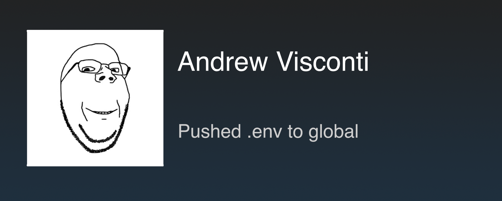

# SteamHub

A macOS menu-bar app that fires a Steam achievement notification — artwork, Arial type,
and the unlock chime — whenever someone pushes to a repository you have cloned locally.



The toast shows the pusher's name on the title line and their commit subject underneath,
wrapped to two lines and truncated with an ellipsis if it doesn't fit.

## Build & run

```sh
./build.sh
open build/SteamHub.app
```

This builds a universal (arm64 + x86_64) app bundle. To hand it to someone else, see
[Sending it to someone else](#sending-it-to-someone-else).

A trophy icon appears in the menu bar. There is no Dock icon or window — it's an
`LSUIElement` agent.

On first launch macOS will ask for access to the folders being scanned (Documents,
Desktop, …). Approve it or the scan finds nothing.

## Sending it to someone else

```sh
./package.sh
```

produces `build/SteamHub.zip` (~1.4 MB, universal — Apple Silicon and Intel), containing
`SteamHub.app`, `install.sh`, and `INSTALL.txt`. Send that one file however you like —
Slack, email, Drive, AirDrop.

### What they do

Unzip, then in Terminal from that folder:

```sh
./install.sh
```

That's the whole setup. It installs to `/Applications`, launches, and the app's own setup
window opens showing how many repos it found. **No Gatekeeper prompt, no System Settings
detour.**

Why it works: macOS attaches `com.apple.quarantine` to files a browser, Slack, or Mail
downloads, and that flag is what triggers *"Apple could not verify this app."* But
quarantine only blocks **launching** a thing — double-clicking an app or a `.command`.
Running a script from the shell is not blocked, so `./install.sh` executes normally even
while quarantined, and the first thing it does is strip the flag off the copy it installs.

If you'd rather host the zip (GitHub Releases, S3, a static site), it collapses to a
single line the recipient pastes, and `curl` never sets quarantine in the first place:

```sh
curl -fsSL https://…/install.sh | bash -s https://…/SteamHub.zip
```

### If they'd rather not run a script

Drag `SteamHub.app` to `/Applications` and double-click — then macOS blocks it and they
need **System Settings → Privacy & Security → Open Anyway**, once. Right-click → Open no
longer bypasses this on macOS 15+, so don't bother suggesting it. `INSTALL.txt` in the zip
spells out both routes.

### Removing the warning entirely — Developer ID + notarization ($99/yr)

The app opens with no warning at all. With a *Developer ID Application* certificate in
your keychain, store a notarytool profile once:

```sh
xcrun notarytool store-credentials steamhub \
    --apple-id you@example.com --team-id TEAMID --password <app-specific-password>
```

then package:

```sh
SIGN_ID="Developer ID Application: Your Name (TEAMID)" \
NOTARY_PROFILE=steamhub ./package.sh
```

That signs with the hardened runtime and a secure timestamp, uploads to Apple, waits for
the ticket, staples it into the bundle, and re-zips. Stapling matters: it lets their Mac
verify offline.

### What the recipient needs

- macOS 13 or later.
- Git. Every Mac has `/usr/bin/git`, but on a machine that has never installed the Xcode
  Command Line Tools it's a stub that pops an installer prompt on first use.
- Their own repos, cloned locally, with working push access — SteamHub reuses the SSH
  keys and credential helper git already has. It ships no credentials of yours.

Settings are per-machine (`com.visconti.SteamHub` in `UserDefaults`), so they configure
their own scan folders; nothing about your setup travels in the zip.

### First run

The setup window opens by itself and reports what the scan found, so nobody has to guess
whether it's working:

- **Found repos** — green check with the count, and the folders it searched.
- **Found none** — orange warning plus **Add Folder…**, which is also the escape hatch if
  their clones live somewhere unusual (`~/work`, an external drive) or if they denied the
  permission prompt. Picking a folder through the open panel grants access to it directly,
  so it works even without Full Disk Access.
- **Show Me One** fires a sample achievement, so they see and hear it immediately.

Reopen it any time from the menu bar: **Setup…**

SteamHub registers itself as a login item on first launch, so it's running before anyone
has to think about it — a push notifier that isn't running notifies nothing, and an agent
with no Dock icon gives you nothing obvious to relaunch from. The setup window says so
explicitly rather than doing it silently, and **Launch at Login** in the menu turns it off.
That choice is applied exactly once, so switching it off is not undone on the next launch.

macOS asks once for access to Documents/Desktop. `Info.plist` supplies the reason string,
so the prompt explains why instead of appearing blank.

## How it detects pushes

There is no webhook and no server. A local app can't receive one without a public URL,
so SteamHub polls instead:

1. On a timer (default 60s) it runs `git fetch --prune` in each watched repo.
2. It compares every `refs/remotes/<remote>/*` ref against the previous poll.
3. Any ref that moved is a push; the new commits behind it are read with `git log`,
   giving the author name and subject directly.

Consequences worth knowing:

- Works with **any** git host — GitHub, GitLab, Bitbucket, self-hosted. No tokens, no
  API keys, no config on the repo side.
- It reuses whatever SSH keys or credential helper git already uses. Prompts are
  disabled (`GIT_TERMINAL_PROMPT=0`, `ssh -o BatchMode=yes`) and every git call is killed
  after 45s, so a repo needing interactive auth is skipped rather than hanging the app.
- Detection lags by up to one poll interval.
- The **first** poll of a repo only records a baseline, so adding a repo never dumps its
  existing branches into your face.
- It fetches, so remote-tracking refs advance. Your working tree, index, and local
  branches are never touched — `fetch` is not `pull`.
- At most 5 commits are reported per ref per poll, so a 200-commit merge can't turn into
  a 200-toast queue.
- Overlapping toasts queue and play one at a time.

## Menu

| Item | What it does |
| --- | --- |
| **Repositories** | Every discovered repo, with a checkmark to mute it. Add one by hand, or rescan. |
| **Scan Folders** | Folders searched for `.git` directories (4 levels deep). Click one to stop scanning it. |
| **Check Every** | Poll interval: 30s / 1m / 5m / 15m. |
| **Check Now** | Force an immediate poll. |
| **Test Notification** | Fire a sample toast. |
| **Setup…** | Reopen the first-run window. |
| **Launch at Login** | Registers via `SMAppService`. **On by default.** |

Default scan roots are `~/Documents`, `~/Developer`, `~/Projects`, `~/Desktop`, `~/src`,
and `~/code` — whichever exist. `node_modules`, `Pods`, `.build`, `vendor`, `build`,
`dist`, and friends are skipped, and the walk stops descending as soon as it finds a repo.

Click a toast to dismiss it early.

## Layout

`AchievementView` positions text as fractions of the notification's own size, so it
scales cleanly. The constants were measured off `reference.png` by profiling the ink rows
of the rendered text:

| | Value (fraction) |
| --- | --- |
| Text left edge | 0.3543 × width |
| Text right edge | 0.9550 × width |
| Title size / baseline | 0.1381 H / 0.3540 H |
| Body size / baseline | 0.0947 H / 0.6844 H |
| Body line spacing | 0.1138 H |

Title `#FFFFFF`, body `#DBD9D8`, Arial (Helvetica as the metric-compatible fallback).
A re-render at reference dimensions lands every ink band within 0.1% of the original.

The notification is 420×168pt — the 1920×768 artwork's aspect ratio — pinned 12pt from
the bottom-right of the visible frame on whichever display holds the cursor.

## Files

```
Sources/SteamHub/
  main.swift             entry point, accessory activation policy
  AppDelegate.swift      status item and menu
  Settings.swift         UserDefaults-backed config
  RepoScanner.swift      depth-limited .git search
  Git.swift              git subprocess wrapper, prompt-proof and timeout-bounded
  RepoWatcher.swift      poll loop, ref diffing, commit extraction
  AchievementView.swift  Core Text rendering of the toast
  ToastPresenter.swift   window, queue, animation, sound
  WelcomeWindow.swift    first-run setup
  Resources/             full-achievement.png, steam-achievement.mp3

build.sh                 universal build -> build/SteamHub.app
package.sh               build + zip, optionally notarize -> build/SteamHub.zip
install.sh               install + launch, quarantine-free
make-icon.sh             chud.png -> AppIcon.icns (only when the art changes)
```

## App icon

`AppIcon.icns` is generated from `chud.png` by `./make-icon.sh` and committed, so a normal
build just copies it. Regenerate after changing the source art.

The generator trims the source to its drawn area first — the face occupies only 185×288 of
chud.png's 360×360 canvas, so without the crop it renders as a small mark adrift in white
space. It then centres the art on the standard macOS tile (824/1024 wide, 185.4 corner
radius) at 78% width, which stays legible down to 32pt.

The menu-bar icon is deliberately *not* this: it stays an SF Symbol trophy, which is
monochrome and adapts to light and dark menu bars the way macOS expects.

To change the notification art or sound, replace the files in `Sources/SteamHub/Resources/`
and rebuild. Swapping in a different aspect ratio means re-measuring the fractions above.
